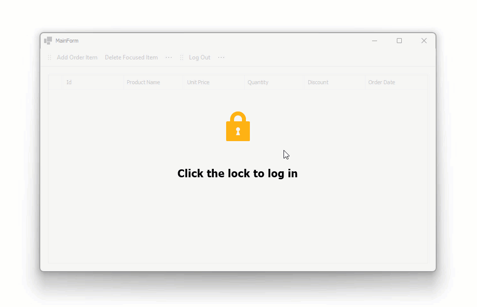

<!-- default badges list -->

[](https://supportcenter.devexpress.com/ticket/details/T1280921)
[](https://docs.devexpress.com/GeneralInformation/403183)
[](#does-this-example-address-your-development-requirementsobjectives)
<!-- default badges end -->
# Connect a WinForms Data Grid to an ASP.NET Core WebAPI Service Using EF Core — Authorization Code Flow

> **NOTE**: Our [Connect a WinForms Data Grid to an ASP.NET Core WebAPI Service — Authenticate Users and Protect Data](https://github.com/DevExpress-Examples/connect-winforms-grid-to-dotnetcore-service-enable-pbac) example adds a user login and permission-based access control feature using **Resource Owner Password Credentials (ROPC)**. This approach, while familiar in traditional client applications, requires the application to collect and transmit user credentials, which creates security-related issues.

To enhance security, this specific example leverages **Authorization Code Flow** (designed for applications that need to authenticate users without directly handling user credentials). Authorization Code Flow ensures that credentials remain within the authentication service, reducing the risk of misuse.



## Update the Keycloak Configuration

Use the following steps to configure Keycloak for **Authorization Code Flow**:

### Verify 'openid' Scope

1. Navigate to **Client scopes** in your realm settings.
2. Check if the openid scope is listed. If missing, click **Create client scope** and do the following:
    * Enter openid as the name.
    * Select **OpenID Connect** as the protocol.
    * Set type to **Default**.
    * Save the entry.

### Register a New Client

1. Go to **Clients** and click **Create client**.
2. Select **OpenID Connect** as the client type.
3. Enter a **Client ID** ('appAuthFlow1' in this example).
4. Click **Save**.

### Configure Authentication Flow

1. Open the **Capability config** page.
2. Locate the **Authentication flow** section.
3. Uncheck **Direct access grant** (it may be enabled by default).
4. Ensure **Standard flow** remains active (required for the Authorization Code Flow).

### Define Redirect URIs

1. Open the **Login settings** page.
2. Add at least one valid **Redirect URI**. For this sample, use: `winappdemo://*`.

## Run the Example

Refer to the following step-by-step tutorial to run the example: [Getting Started](https://github.com/DevExpress-Examples/connect-winforms-grid-to-dotnetcore-service?tab=readme-ov-file#getting-started).

## Implementation Details

### Register a Custom Protocol Handler in Windows

Register a custom protocol prefix in Windows. This allows Windows to recognize the URL format and launch your application when redirection occurs (details that are passed through by the URL are supplied as command-line arguments).

The `RegisterProtocol` registers a custom protocol in the registry:

```csharp
static void RegisterProtocol()
{
  // The name of the custom protocol must correspond to your Valid URI configuration on the Keycloak side.
  string customProtocol = “winappdemo”;
  string applicationPath = Application.ExecutablePath;
  var keyPath = $@“Software\Classes\{customProtocol}”;
  using (var key = Registry.CurrentUser.CreateSubKey(keyPath, true))
  {
    if (key == null)
    {
      throw new Exception($”Registry key can’t be written: {keyPath}”);
    }
    key.SetValue(string.Empty, “URL:” + customProtocol);
    key.SetValue(“URL Protocol”, string.Empty);
    using (var commandKey = key.CreateSubKey(@“shell\open\command”))
    {
      commandKey.SetValue(string.Empty, $”{applicationPath} %1”);
    }
  }
}
```

This example implements a mechanism that uses a named pipe to send incoming protocol information to a running instance of the same application.

On startup, if no parameters are found on the command line, the application attempts to start a listener for the named pipe. The `HandleProtocolMessage` method passes the message to `DataServiceClient`:

```csharp
private const string pipeName = “WinAppDemoProtocolMessagePipe”;
…
static void StartProtocolMessageListener()
{
  Task.Run(async () =>
  {
    while (true)
    {
      using var server = new NamedPipeServerStream(pipeName, PipeDirection.In);
      server.WaitForConnection();
      using var reader = new StreamReader(server);
      var msg = reader.ReadToEnd();
      await HandleProtocolMessage(msg);
    }
  });
}

static async Task HandleProtocolMessage(string msg)
{
  Console.WriteLine($”Handling protocol message: ‘{msg}’”);
  await DataServiceClient.AcceptProtocolUrl(msg);
}
```

If a command-line parameter is detected, the application tries to pass details to an existing instance.

```csharp
static void SendProtocolMessage(string msg)
{
  using var client = new NamedPipeClientStream(“.”, pipeName, PipeDirection.Out);
  // The `Connect` call uses a short timeout. If no running instance is found, there is an error in the process.
  client.Connect(500);
  using var writer = new StreamWriter(client) { AutoFlush = true };
  writer.Write(msg);
}
```

### Implement Authorization Code Flow

Login logic is divided into two parts:

1. A login method that calls `DataServiceClient`.
2. An event handler that listens for login status changes in `DataServiceClient` and updates the UI accordingly.

**Authorization Code Flow** begins in the `DataServiceClient.LogIn` method. This implementation uses `Url.Combine` from the [Flurl](https://flurl.dev/) library to construct the required URL.

`Process.Start` initiates the login, which opens the **default system browser** and navigates to the Keycloak login page.

```csharp
var url = Url.Combine(authUrl, “realms”, realm, “protocol”, “openid-connect”, “auth”)
  .SetQueryParams(
    new
    {
      response_type = “code”,
      client_id = clientId,
      redirect_uri = redirectUri,
      scope = “openid profile email”,
    }
);

Process.Start(new ProcessStartInfo(url) { UseShellExecute = true });
```

Once the user successfully logs in, Keycloak redirects to the registered URI, which triggers a second instance of the application. This instance calls `DataServiceClient.AcceptProtocolUrl` to process the authorization response.

```csharp
public static async Task AcceptProtocolUrl(string protocolUrlString)
{
  var protocolUrl = new Url(protocolUrlString);
  if (
    protocolUrl.QueryParams.TryGetFirst(“code”, out object codeObject)
    && codeObject is string code
  )
  {
    CheckSettings([“authUrl”, “realm”, “clientId”, “redirectUri”]);

    var content = new FormUrlEncodedContent(
      new Dictionary<string, string>
      {
        { “grant_type”, “authorization_code” },
        { “client_id”, clientId! },
        { “code”, code },
        { “redirect_uri”, redirectUri! },
      }
    );
    var url = Url.Combine(
      authUrl,
      “realms”,
      realm,
      “protocol”,
      “openid-connect”,
      “token”
    );

    var response = await bareHttpClient.PostAsync(url, content);

…
```

The `DataServiceClient.GetTokens` method obtains the following tokens:

* `id_token`
* `access_token`
* `refresh_token`
* `expires_in`

```csharp
static (
    string? id_token,
    string? access_token,
    string? refresh_token,
    int? expires_in
) GetTokens(string jsonString)
{
    var node = JsonNode.Parse(jsonString);
    if (node == null)
        return (null, null, null, null);
    else
        return (
            node[“id_token”]?.GetValue<string>(),
            node[“access_token”]?.GetValue<string>(),
            node[“refresh_token”]?.GetValue<string>(),
            node[“expires_in”]?.GetValue<int>()
        );
}
```

### User Login Experience

Once the login process starts, the user is redirected to the Keycloak authentication page in a browser. The demo includes two test accounts:

* **Username**: `reader` | **Password**: `reader`
* **Username**: `writer` | **Password**: `writer`

After successful authentication, Keycloak redirects the user back to the **WinForms application**, completing the authorization process.

<!-- feedback -->
## Does This Example Address Your Development Requirements/Objectives?

[](https://www.devexpress.com/support/examples/survey.xml?utm_source=github&utm_campaign=connect-winforms-grid-to-dotnetcore-service-enable-auth-code-flow&~~~was_helpful=yes) [](https://www.devexpress.com/support/examples/survey.xml?utm_source=github&utm_campaign=connect-winforms-grid-to-dotnetcore-service-enable-auth-code-flow&~~~was_helpful=no)

(you will be redirected to DevExpress.com to submit your response)
<!-- feedback end -->
